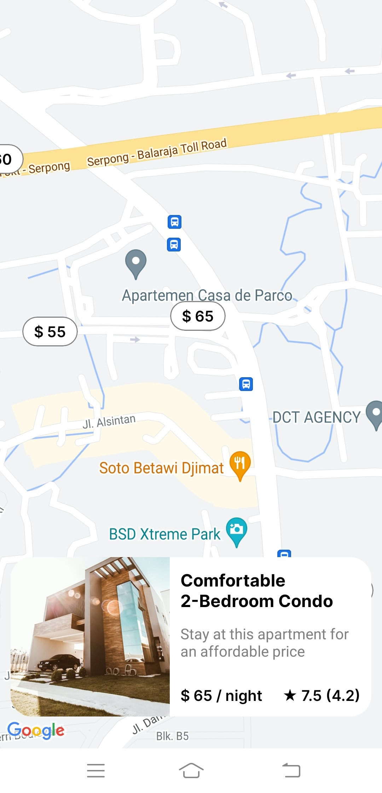
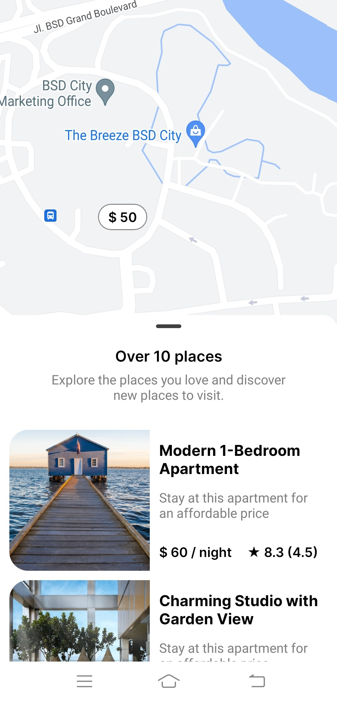
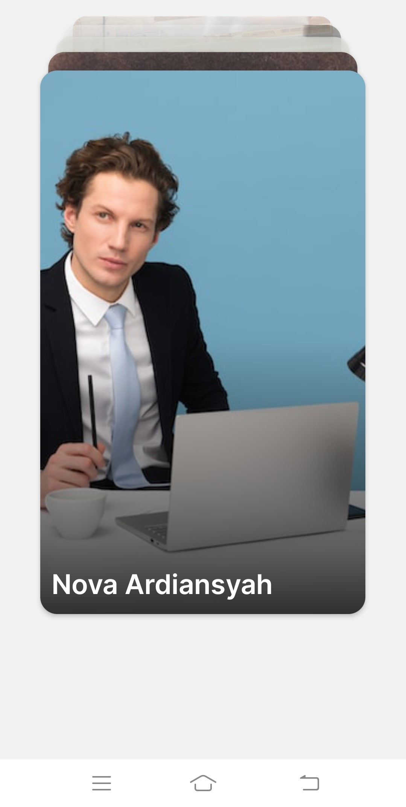

# Expo Started Kit

Hello Future Developer!

Welcome to my latest creation - the *Expo Starter Kit*! I'm diving into some of the hottest technologies right now, and it's a new and exciting journey for me because I haven't used them before. This time around, I'm exploring what I can build and develop with these technologies, especially for mobile devices like Android and iOS.

Just to give you some background, I'm a web developer at a *Software House* where I primarily work with web development technologies. However, I've always had the desire to create an elegant, dynamic, modern, and easily-developable mobile application using the knowledge I've gained. After some extensive exploration, I stumbled upon a powerful technology called **React Expo**. It exceeded my expectations, allowing me to build mobile applications using just *JavaScript/TypeScript* with minimal adjustments. Surprisingly, I didn't need to delve into *Native* programming languages at all, making it a perfect fit for my needs.

*Thank you for your interest. Happy coding!*

## Powering Up with an Electrifying Tech Stack! ⚡

This project is fueled by an electrifying lineup of cutting-edge technologies:

- [React Native](https://reactnative.dev/) - Elevate your mobile app development experience.
- [Expo](https://expo.dev/) - Streamline the process of building robust and scalable mobile applications.

Prepare for an exhilarating ride through innovation and efficiency with this impressive tech stack!

## Licensing Groove🕺

Exciting news! This project is grooving to the rhythm of the [MIT License](https://github.com/novaardiansyah/Expo-Started/blob/main/LICENSE)! 🎉

## Let's Connect! 📞

Need to chat? Feel free to drop me a line via [Email](mailto:novaardiansyah78@gmail.com) or hit me up on [WhatsApp](https://wa.me/6289506668480?text=Hi%20Nova,%20I%20have%20a%20question%20about%20your%20project%20on%20GitHub:%20https://github.com/novaardiansyah/Expo-Started). I'm just a message away, ready to groove with you! 📩

## Sneak Peek (Dev) 🌟

Get a glimpse of the app's enchanting world by exploring the current progress at [live demo not available](). Feast your eyes on these snapshots that showcase the app's dynamic essence:

  
  

  

## Project Status 🚀 

